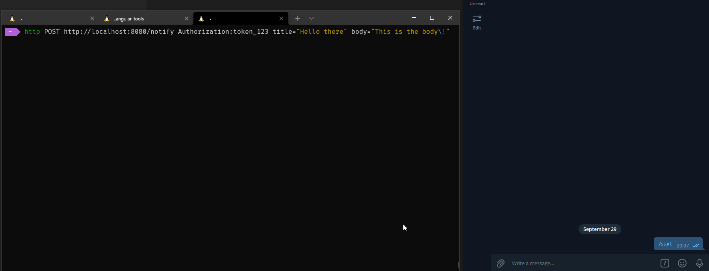

# Notifier



A simple microservice which accepts incoming notifications, and questions and redirects them to notification sinks such as Telegram, Email etc.

## Building

```sh
$ go get -u github.com/swaggo/swag/cmd/swag
$ go generate . && go build .
```

You can also use the provided dockerfile.

## Configuration

Put this to `notifier-config.yaml` at `./notifier-config.yaml`, `/etc/notifier/notifier-config.yaml` or  `~/.config/notifier/notifier-config.yaml`:

```yaml
http:
  jwt_secret: <jwt secret here> # enter jwt secret here (some random characters)
  addr: :8080
sinks:
  - type: telegram
    bot_token: <bot token here>
    chat_id: <chat id to post messages to>
  - type: email
    from: "notifications@example.com"
    to:
      - "me@example.com"
    smtp_address: "mail.example.com:587"
    smtp_username: "notifications@example.com"
    smtp_password: "cocker12"
    starttls: true
users:
  - username: user # used to login via web and view API docs at :8080
    password: pass
  - username: my-script
    token: JzvFZ9Rt0lAq6loSrr6nKN4AwfTYfEK1PnhZwWb # Add it in the `Authorization` header to authenticate

```

## Api docs

See [docs/swagger.md](./docs/swagger.md). Or go to the IP of the server and log-in.


## License

This project is licensed under the MIT.
